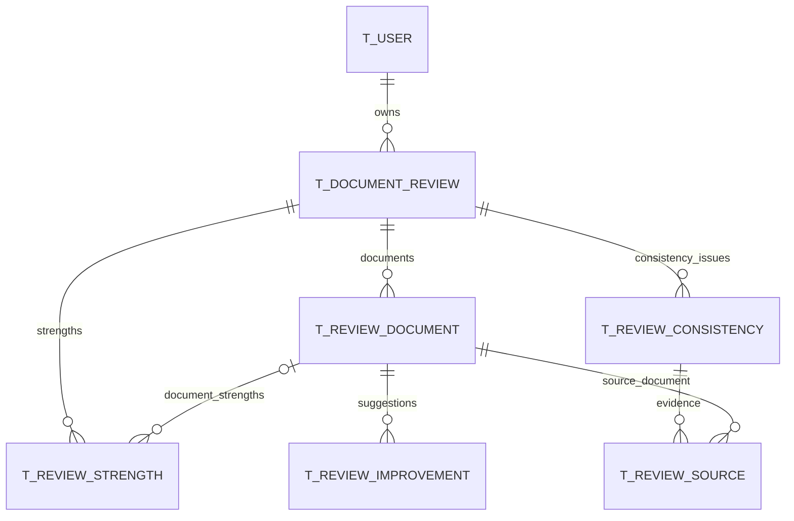

# AI원클릭첨삭 기록 저장 설계

현재 결과 화면의 모든 데이터는 6개 테이블에 저장한다. 한 번의 통합 첨삭을 `REVIEW_NUM`으로 묶고, 같은 서류를 다시 첨삭하면 새로운 기록을 만든다. 완료된 기록은 원본 문서 변경에 따라 덮어쓰지 않는다.

DDL: [document_review_schema.sql](../src/main/resources/sql_query/document_review_schema.sql). 기존 `T_USER`가 있는 Oracle 19c 스키마에 한 번 적용하는 별도 스크립트다. 기존 `schema.sql`과 `drop.sql`에는 통합하지 않았다. 2026-09-29 로컬 DB에서 6개 테이블·5개 시퀀스와 200자 입력 컬럼을 확인했다. 이미 적용한 DB에 CREATE 스크립트를 다시 실행하지 않는다.

현재 구현은 **OpenAI Responses API 생성 1회로 첨삭과 취업 준비 추천을 받아 저장한다.** `MODEL_NAME = 'gpt-6-sol'`, effort `medium`, `PROMPT_VERSION = 'document-review-v3'`, `RESPONSE_VERSION = 2`, `resultSource = 'AI'`를 사용한다. 과거 `dummy-document-review-*` 기록은 `DUMMY`로 표시하며 새 요청에는 더미 생성기를 사용하지 않는다. 실제 요청·검증·프롬프트는 [OpenAI 연결 문서](document-review-openai.md)를 참고한다.

기존 DB에는 [migrate_document_review_preparation.sql](../src/main/resources/sql_query/migrate_document_review_preparation.sql)을 적용한다. `T_DOCUMENT_REVIEW.CAREER_PREPARATION_JSON` CLOB 컬럼과 JSON CHECK 제약만 추가하며 반복 실행할 수 있다. 신규 DB의 첨삭 DDL에는 이미 포함되어 있다. 기존 기록은 컬럼이 NULL인 채 유지하고 상세 응답의 `careerPreparation`도 null로 반환한다.

2026-09-29 프로젝트에 설정된 로컬 Oracle에 이 마이그레이션을 적용했고 반복 실행, CLOB 타입, JSON 제약과 기존 기록 수 보존을 확인했다. API 연결은 이미 존재하는 상태·오류 컬럼을 사용하므로 추가 DDL은 없다. 실행 중인 Tomcat에는 수정한 백엔드의 재빌드·재게시가 필요하다.

## 별도 취업 준비 추천

`careerPreparation`은 첨삭과 구분한 응답이다. 당시 이력서의 `occupationCode`, `occupationName`, `jobCode`, `jobName`과 `summary`, `coverageNote`, `recommendations[]`를 JSON 전체로 부모 기록에 보관한다. 추천 항목은 `category`(experience, skill, certification, qualification), `title`, `reason`, `action`으로 구성한다. MyBatis가 CLOB으로 저장·조회하며 별도 테이블이나 DAO는 추가하지 않았다. 현재 클라이언트는 추천 결과를 전송하지 않으며 서버가 직접 구성한다.

AI가 선택한 이력서·자기소개서·PDF를 함께 검토해 현재 서류에 언급되지 않은 경험·기술·자격증·스펙을 0~8개 제안한다. 직군·직무 이름이 모두 없으면 추천을 비운다. 서버는 반환한 직군·직무가 이력서와 같은지, 항목 형식·분량과 제목 중복을 검증한다. 검토 범위와 PDF 읽기 제한은 coverageNote에 표시한다.

추천은 서류에 언급되지 않은 준비 제안이며 실제 미보유 여부·취업 필수 자격을 뜻하지 않는다. 기록 상세 조회에서는 현재 원본 서류로 추천을 다시 만들지 않고 저장된 JSON을 그대로 반환한다. 따라서 원본 직무나 내용이 변경·삭제되어도 당시 추천이 유지된다. 첨삭·추천은 같은 결과 트랜잭션에서 저장한다.

## 관계



처리 중이거나 실패한 요청도 존재하므로 ERD에는 자식 행이 0개인 상태를 허용한다. 완료 시 이력서와 자기소개서가 각각 1개 있어야 한다. 포트폴리오는 0개 또는 1개다.

## 테이블별 저장 내용

| 테이블 | 주요 컬럼 | 저장 내용 |
| --- | --- | --- |
| `T_DOCUMENT_REVIEW` | `REVIEW_NUM`, `USER_NUM`, `REVIEW_TITLE`, `REVIEW_STATUS`, `REVIEW_MODE`, `CUSTOM_CRITERIA`, `INSTRUCTIONS`, `OVERALL_SUMMARY`, `CREATED_AT`, `FINISHED_AT` | 첨삭 1회, 사용자, 선택 기준·직접 입력·추가 요청, 종합 피드백, 처리 상태·시각 |
| `T_REVIEW_DOCUMENT` | `REVIEW_DOCUMENT_NUM`, `REVIEW_NUM`, `DOCUMENT_TYPE`, `SOURCE_DOCUMENT_NUM`, `DOCUMENT_TITLE`, `SOURCE_SNAPSHOT_JSON`, `DOCUMENT_SUMMARY` | 첨삭한 문서별 원문 보관본과 피드백 |
| `T_REVIEW_STRENGTH` | `STRENGTH_NUM`, `REVIEW_NUM`, `REVIEW_DOCUMENT_NUM`, `DISPLAY_ORDER`, `STRENGTH_CONTENT` | 전체 강점과 문서별 강점 |
| `T_REVIEW_IMPROVEMENT` | `IMPROVEMENT_NUM`, `REVIEW_DOCUMENT_NUM`, `DISPLAY_ORDER`, `SECTION_NAME`, `IMPROVEMENT_TITLE`, `ISSUE_CONTENT`, `ORIGINAL_CONTENT`, `SUGGESTED_CONTENT`, `REASON_CONTENT` | 수정 대상 항목·제목·문제점·원문·수정 제안·이유 |
| `T_REVIEW_CONSISTENCY` | `CONSISTENCY_NUM`, `REVIEW_NUM`, `DISPLAY_ORDER`, `ISSUE_TYPE`, `ISSUE_TITLE`, `RECOMMENDATION` | 내용 불일치·근거 보완·확인 필요와 개선 방향 |
| `T_REVIEW_SOURCE` | `CONSISTENCY_NUM`, `DISPLAY_ORDER`, `REVIEW_NUM`, `REVIEW_DOCUMENT_NUM`, `SECTION_NAME`, `SOURCE_CONTENT`, `PAGE_NUMBER` | 일관성 항목별 비교 문서·위치·인용 원문·PDF 페이지 |

식별자는 기존 프로젝트처럼 `NUMBER(18)`과 시퀀스를 사용하며 Java에서는 `Long`으로 매핑한다. `USER_NUM`은 기존 `T_USER.USER_NUM`과 같은 `NUMBER(9)`다. 긴 피드백과 원문은 `CLOB`, 정렬 순서는 1부터 시작하는 `NUMBER(9)`로 저장한다.

### 첨삭 기록

`REVIEW_STATUS`는 `PROCESSING`, `COMPLETED`, `FAILED`다. 완료와 실패는 `FINISHED_AT`이 필수이고, 실패 시 `ERROR_MESSAGE`도 필수다. `MODEL_NAME`, `PROMPT_VERSION`, `RESPONSE_VERSION`으로 당시 생성 조건과 응답 구조 버전을 기록한다. 완료된 결과의 `OVERALL_SUMMARY`는 서버가 필수로 검증한다.

`REVIEW_MODE`는 화면의 select에서 고른 기준 1개를 저장한다. 기본값은 `comprehensive`이고 DB CHECK 제약으로 다음 6개 값만 허용한다.

| 화면 선택 항목 | `REVIEW_MODE` |
| --- | --- |
| 전체 종합 첨삭 | `comprehensive` |
| 문장 표현·가독성 중심 | `expression` |
| 서류 간 일관성 중심 | `consistency` |
| 직무 적합성 중심 | `jobFit` |
| 성과·구체성 중심 | `evidence` |
| 직접 입력 | `custom` |

`CUSTOM_CRITERIA`는 `VARCHAR2(200 CHAR)`이며 `REVIEW_MODE = 'custom'`일 때만 필수다. DB CHECK 제약으로 NULL이나 공백 문자만 있는 직접 입력을 거부한다. 다른 기준에서는 NULL이어야 한다. 화면에서 다른 기준으로 전환할 때 유지되는 직접 입력 초안은 해당 요청에 저장하지 않는다.

`INSTRUCTIONS`는 선택 입력인 추가 요청으로, 프론트와 동일한 `VARCHAR2(200 CHAR)`다. 서버는 두 입력의 길이를 각각 200자 이내로 검증하고 앞뒤 공백을 제거한다. 비어 있는 추가 요청은 Oracle의 빈 문자열 처리에 맞춰 NULL로 저장한다. 기존 다중 선택용 JSON 컬럼은 단일 선택 기준 컬럼으로 교체했다.

프론트 요청의 `reviewMode`, `customCriteria`, `instructions`를 각각 `REVIEW_MODE`, `CUSTOM_CRITERIA`, `INSTRUCTIONS`에 매핑한다. 저장된 기록 상세 조회에서도 이 세 값을 반환해 당시 요청 설정을 확인할 수 있게 한다.

### 문서 보관본

`UNIQUE(REVIEW_NUM, DOCUMENT_TYPE)`으로 한 기록에 같은 종류의 서류가 중복되지 않게 한다. 종류는 프론트와 동일한 `resume`, `cover-letter`, `portfolio`를 사용한다.

`SOURCE_DOCUMENT_NUM`은 각각 `T_RESUME.RESUME_NUM`, `T_COVER_LETTER.LETTER_NUM`, `T_PORTFOLIO.PORTFOLIO_NUM`을 기록한다. 이 번호에는 원본 테이블 FK를 걸지 않는다. 과거 기록은 원본 삭제 후에도 남아야 하므로 요청 당시 서버가 문서 존재 여부와 소유권을 검증하고 내용을 복사한다.

`DOCUMENT_TITLE`, `SOURCE_UPDATED_AT`, `SOURCE_SNAPSHOT_JSON`도 당시 값을 저장한다. 이력서는 기본 정보·학력·경력·자격증을 포함한 실제 첨삭 입력 전체, 자기소개서는 각 항목의 전체 내용을 저장한다. PDF를 텍스트나 페이지로 변환했다면 실제 사용한 페이지별 텍스트와 메타데이터도 보관본에 포함한다. 조회 시 현재 문서의 제목이나 내용을 사용해 과거 기록을 재구성하지 않는다.

결과 화면의 원문·비교 근거는 각각 `ORIGINAL_CONTENT`, `SOURCE_CONTENT`에 직접 저장되므로 원본 파일 없이도 결과를 표시할 수 있다. 과거 포트폴리오 PDF 자체의 다운로드까지 제공하려면 `ORIGINAL_FILE_NAME`과 `PDF_SNAPSHOT`에 파일명과 PDF 바이트를 함께 저장한다. 기존 파일 경로만 저장하면 현재 삭제 로직이 파일을 지우므로 과거 파일 다운로드를 보장하지 못한다.

### 강점과 일관성 근거

`T_REVIEW_STRENGTH.REVIEW_DOCUMENT_NUM`이 NULL이면 전체 강점, 값이 있으면 해당 문서의 강점이다. 같은 기록·범위·표시 순서의 중복은 함수 기반 UNIQUE 인덱스로 막는다.

일관성 항목 하나는 비교 근거 여러 개를 갖는다. `T_REVIEW_SOURCE`는 비교 근거를 `(CONSISTENCY_NUM, DISPLAY_ORDER)`로 식별하고 문서 종류는 연결된 `T_REVIEW_DOCUMENT`에서 가져온다. `PAGE_NUMBER`는 구조화된 페이지 번호가 있을 때만 저장한다. 현재 예시의 `역할 소개 · 3페이지`는 `SECTION_NAME`에 그대로 보존하고, 페이지 번호를 명확하게 파악한 경우에만 별도로 3을 넣는다.

복합 FK에 `REVIEW_NUM`을 포함해 다른 첨삭 기록의 문서를 강점이나 비교 근거로 연결할 수 없게 한다. `DISPLAY_ORDER`로 각 결과 배열의 순서를 보존한다.

## 현재 응답과의 매핑

| 응답 필드 | DB 위치 |
| --- | --- |
| `summary` | `T_DOCUMENT_REVIEW.OVERALL_SUMMARY` |
| `strengths[]` | `T_REVIEW_STRENGTH`, 문서 번호 NULL |
| `documentReviews.{resume,coverLetter,portfolio}.summary` | 해당 종류의 `T_REVIEW_DOCUMENT.DOCUMENT_SUMMARY` |
| `documentReviews.*.strengths[]` | 해당 문서 번호의 `T_REVIEW_STRENGTH` |
| `documentReviews.*.improvements[].section` | `T_REVIEW_IMPROVEMENT.SECTION_NAME` |
| `documentReviews.*.improvements[].title` | `T_REVIEW_IMPROVEMENT.IMPROVEMENT_TITLE` |
| `documentReviews.*.improvements[].issue` | `T_REVIEW_IMPROVEMENT.ISSUE_CONTENT` |
| `documentReviews.*.improvements[].original` | `T_REVIEW_IMPROVEMENT.ORIGINAL_CONTENT` |
| `documentReviews.*.improvements[].suggestion` | `T_REVIEW_IMPROVEMENT.SUGGESTED_CONTENT` |
| `documentReviews.*.improvements[].reason` | `T_REVIEW_IMPROVEMENT.REASON_CONTENT` |
| `consistencyIssues[].type` | `T_REVIEW_CONSISTENCY.ISSUE_TYPE` |
| `consistencyIssues[].title` | `T_REVIEW_CONSISTENCY.ISSUE_TITLE` |
| `consistencyIssues[].recommendation` | `T_REVIEW_CONSISTENCY.RECOMMENDATION` |
| `consistencyIssues[].sources[].documentType` | 근거에 연결된 `T_REVIEW_DOCUMENT.DOCUMENT_TYPE` |
| `consistencyIssues[].sources[].section` | `T_REVIEW_SOURCE.SECTION_NAME` |
| `consistencyIssues[].sources[].text` | `T_REVIEW_SOURCE.SOURCE_CONTENT` |

DB의 `cover-letter`는 응답을 조립할 때 `coverLetter` 키로 변환한다. 포트폴리오를 사용하지 않은 기록에는 포트폴리오 행을 만들지 않고 응답의 `documentReviews.portfolio`는 `null`로 반환한다. 빈 강점·수정 제안·일관성 배열은 해당 자식 행 0개로 표현한다.

현재 포트폴리오 포함 정적 예시를 저장한다고 가정하면 첨삭 기록 1행, 문서 3행, 강점 8행(전체 2 + 문서별 2), 수정 제안 3행, 일관성 항목 2행, 비교 근거 4행이다. 실제 서비스에서는 예시 버튼이 기록을 생성하지 않는다.

## 저장 및 조회 흐름

1. 인증된 사용자 번호로 선택한 이력서·자기소개서·포트폴리오 소유권을 검증한다. 선택 기준의 허용 값, 직접 입력 기준과 추가 요청의 각각 200자 제한, 직접 입력의 필수 여부도 검증한다.
2. 기존 `DocumentService`로 문서 상세를 읽고 JSON 보관본을 만든다. 포트폴리오를 선택했으면 기존 파일 조회 서비스를 통해 PDF 보관본도 저장한다. 파일은 기존 업로드 제한과 동일하게 20MB 이하만 허용한다. 파일 경로나 내부 저장 파일명은 JSON 보관본과 응답에 포함하지 않는다.
3. 서버 리소스의 프롬프트·스키마를 사용한다. 포트폴리오 선택 여부에 맞게 스키마를 좁히고 모든 원문·기준을 포함한 모델 입력을 만든다. 클라이언트가 보낸 결과 JSON은 저장하지 않는다.
4. 짧은 트랜잭션에서 요청(`PROCESSING`)과 서류 보관본을 먼저 저장한다. 트랜잭션 밖에서 OpenAI를 한 번 호출하고 응답을 검증한다.
5. 별도 트랜잭션에서 요청 행을 잠그고 문서 요약·강점·수정 제안·일관성·취업 준비 JSON 전체와 `COMPLETED` 상태를 저장한다. API·검증·저장 실패 시 부분 결과를 롤백하고 별도 트랜잭션에서 `FAILED`, 오류 메시지, 종료 시각을 저장한다.
6. 커밋 후 저장 결과를 읽어 반환한다. 화면은 POST 결과를 바로 표시하고 새로고침·과거 기록 조회 때 상세 API로 같은 기록을 확인한다.

실패해도 요청과 원문은 보존된다. 자동 재시도는 없다. 프로세스 강제 종료나 DB 장애로 PROCESSING이 남은 경우 자동 복구하지 않는다.

완료 후 같은 기록에 결과 자식을 다시 추가하지 않는다. 저장 시 부모 행을 잠그거나 상태를 검사해 이미 완료된 기록의 중복 저장을 막는다. 사용자의 새 첨삭 요청은 새 `REVIEW_NUM`으로 처리한다.

구현 API는 다음과 같다. 모두 기존 `@LoginUser`와 공통 `ApiResponse`를 사용하며 JWT 사용자 번호를 서버에서 결정한다. 클라이언트가 `userNum`을 바꿔도 다른 사용자의 서류나 기록에 접근할 수 없다. 인증되지 않으면 401이며 개인 결과에는 `Cache-Control: no-store`를 적용한다.

| API | 동작 |
| --- | --- |
| `POST /api/document-reviews` | 선택 문서 번호·기준·추가 요청을 검증하고 AI 생성 1회 및 결과 저장, HTTP 201과 저장된 상세 반환 |
| `GET /api/document-reviews?offset=0&pageSize=20` | 본인 기록을 최신순으로 조회; offset은 0 이상, pageSize는 1~100 |
| `GET /api/document-reviews/{reviewNum}` | 본인 기록의 요청 설정·선택 문서 정보·전체 결과 조회; 없거나 타인 기록이면 404 |

서류 조회 DTO·DAO·Mapper, `DocumentService`, 파일 저장 서비스, JWT 처리와 공통 axios 클라이언트를 재사용했다. 새 코드는 첨삭 요청/응답 DTO 3개, 첨삭 전용 Controller·Service·DAO와 **Mapper XML 1개**다. 결과 항목은 응답 DTO의 내부 클래스를 재사용하며 테이블별 서비스나 Java Mapper 인터페이스를 추가하지 않았다. 삭제 및 보관 PDF 다운로드 API는 이번 범위에 포함하지 않는다.

목록 조회 예시:

```sql
SELECT REVIEW_NUM, REVIEW_TITLE, REVIEW_STATUS, CREATED_AT, FINISHED_AT
FROM T_DOCUMENT_REVIEW
WHERE USER_NUM = :userNum
ORDER BY CREATED_AT DESC, REVIEW_NUM DESC
OFFSET :offset ROWS FETCH NEXT :pageSize ROWS ONLY;
```

상세 조회는 먼저 `REVIEW_NUM = :reviewNum AND USER_NUM = :userNum`으로 부모 기록을 확인한다. 이후 문서·강점·수정 제안·일관성 항목·근거를 각각 조회하고 정렬 순서대로 기존 응답 구조를 조립한다. 여러 1:N 배열을 한 번에 JOIN하면 강점과 수정 제안 등이 곱으로 늘어나므로 별도 조회로 구성한다. 응답에는 기록 번호, 상태, 작성 시각, 요청 설정도 함께 제공한다.

첨삭 기록을 삭제하면 자식 결과와 보관본도 FK의 `ON DELETE CASCADE`로 함께 삭제한다. 기존 사용자 탈퇴는 `USER_IS_DELETED`를 변경하는 소프트 삭제이므로 사용자 FK의 CASCADE가 동작하지 않는다. 탈퇴 시 첨삭 기록을 즉시 삭제할 정책이라면 탈퇴 서비스의 트랜잭션에 해당 사용자의 `T_DOCUMENT_REVIEW` 삭제를 추가해야 한다.

## 검증과 실행

- 기존 Spring MVC/Tomcat 프로젝트를 다시 빌드·게시한 뒤 프론트의 **AI 첨삭 시작하기** 버튼을 사용한다. API 키는 `api.properties`의 `api.openai.key`에 설정한다.
- `OpenAiDocumentReviewGeneratorTest`: 로컬 HTTP 서버로 단일 요청·고정 모델/effort, PDF 직접 첨부, 잘못된 형식·인용·직무·페이지·거절·불완전 응답·한도 오류를 검증하며 유료 API를 호출하지 않는다.
- `DocumentReviewValidationTest`: 필수 번호·기준·200자 제한, 인증 누락, 서류 소유권, 목록 범위를 검증한다.
- `OracleDocumentReviewPersistenceTest`: 실제 Oracle의 격리 테이블·시퀀스로 결과/JSON/PDF 보관본, 포트폴리오 생략, 과거 조회, 짧은 트랜잭션, 실패 기록·부분 결과 롤백과 REST 반환을 검증한다. 기존 테이블·데이터를 수정하지 않으며 테스트 객체는 종료 시 제거한다. `mvn -Dprovit.oracle.documentReviewTests=true -Dtest=OracleDocumentReviewPersistenceTest test`로 실행한다. 추가로 `-Dprovit.openai.documentReviewTests=true`를 지정하면 합성 문서·PDF로 실제 유료 API 호출 1회와 Oracle 저장·재조회도 실행한다. 기본 실행에서는 외부 API를 호출하지 않는다.

## Oracle 참고

- [Oracle 19c JSON 컬럼과 IS JSON 제약](https://docs.oracle.com/en/database/oracle/oracle-database/19/adjsn/creating-a-table-with-a-json-column.html)
- [Oracle 19c SQL/JSON 조건](https://docs.oracle.com/en/database/oracle/oracle-database/19/sqlrf/SQL-JSON-Conditions.html)
- [Oracle 19c 외래 키 및 삭제 동작](https://docs.oracle.com/en/database/oracle/oracle-database/19/adfns/data-integrity.html)
- [Oracle 19c 정규식 CHECK 제약](https://docs.oracle.com/en/database/oracle/oracle-database/19/adfns/regexp.html)
